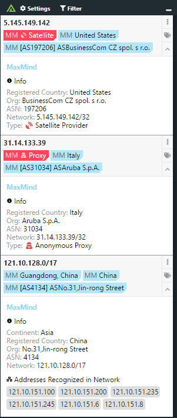

# Polarity MaxMind Integration

The Polarity [Maxmind](https://www.maxmind.com/) integration allows Polarity to retrieve geolocation information for IPv4 and IPv6 addresses using the MaxMind GeoIP2 or GeoLite2 databases.  

You can download the free MaxMind GeoLite2 City and ASN databases directly from MaxMind at [https://dev.maxmind.com/geoip/geolite2-free-geolocation-data/](https://dev.maxmind.com/geoip/geolite2-free-geolocation-data/)

We recommend downloading the latest `GeoLite2 City` database (in binary `mmdb` format) and `GeoLite2 ASN` database (also in binary `mmdb` format).  Both of these databases should be uploaded to your Polarity Server.  See Installation Instructions for more information.

|  |
|---|
|*MaxMind lookup example* |

 
## Installation Instructions

### Cloning the Integration

When cloning this integration please ensure you save the integration into a directory that is not named `maxmind`.  This is due to a conflict with Polarity's legacy client-side maxmind integration.  As an example, if using git to clone the repo onto your Polarity Server you would use the following command to clone the repo into a directory called `maxmind.server`.

```
git clone https://github.com/polarityio/maxmind.git maxmind.server
```

### Updating the MaxMind Databases

This integration includes the free MaxMind City and ASN database.  New databases are released on the first tuesday of each month and we recommend keeping your database updated with the latest version.  To do this you can download both the MaxMind GeoLite2 City and MaxMind GeoLite2 ASN databases from the MaxMind website after creating a free account.  For more information and to create a free account please see:

https://dev.maxmind.com/geoip/geoip2/geolite2/

After downloading and untaring the files you should have two database files:

```
GeoLite2-City.mmdb
GeoLite2-ASN.mmdb
```

Upload these database files to your polarity server's MaxMind integration directory.  For example, if you saved the maxmind integration into a directory called `maxmind.server` then you would place the two maxmind database files into the directory:
 
```
/app/polarity-server/integrations/maxmind.server/database
```

Additional installation instructions for integrations are provided on the [PolarityIO GitHub Page](https://polarityio.github.io/).

## MaxMind Integration Options

### Country Blacklist

A blacklist of countries to hide results from (i.e., no results will be shown for selected countries). You cannot provide both a Country Blacklist and a Country Whitelist.

> If no "Country Whitelist" and no "Country Blacklist" are set, then all results will be returned.

### Country Whitelist

A whitelist of countries that results should be shown for (i.e., results will only be shown for selected countries). You cannot provide both a Country Blacklist and a Country Whitelist.

> If no "Country Whitelist" and no "Country Blacklist" are set, then all results will be returned.

### Return all Countries for On-Demand Lookups

If checked, the integration will return results for all countries when an On-demand search is run (i.e., Country Whitelist and Country Blacklist settings will be ignored for On-Demand lookups).

### Show Full Country Name

If checked, integration will always display the full country name rather than just the country ISO Code in the MaxMind notification summary

### Show State

If checked, the integration will display the state or subdivision information when available in the MaxMind notification summary

### Show ASN and Org Info

If checked, the integration will display the ASN and organization information as a summary tag

## Polarity

Polarity is a memory-augmentation platform that improves and accelerates analyst decision making.  For more information about the Polarity platform please see:

https://polarity.io/

> This product includes GeoLite2 data created by MaxMind, avalable from
<a href="http://www.maxmind.com">http://www.maxmind.com</a>.

